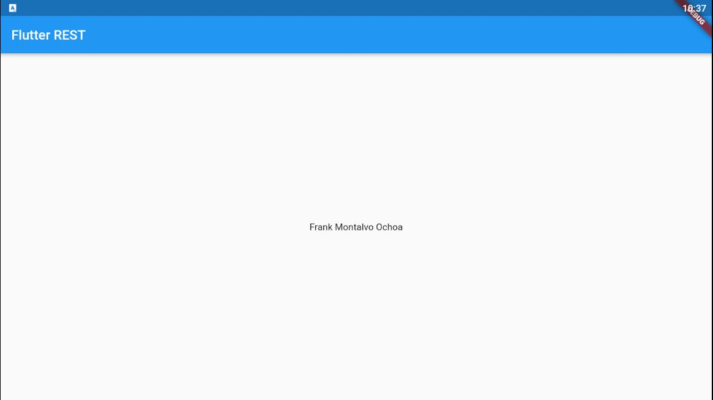

<p align="center">
    
</p>

# Cliente REST Flutter 

* Instalar json-server:

    `npm install -g json-server`

* Crear una aplicación nueva con flutter:

    `flutter create --org ups.edu.ec flutter_rest`

# Paquetes necesarios

- [Http](https://pub.dev/packages/http)
- [Auth](https://pub.dev/packages/firebase_auth)

# Ejemplo de código

### Aplicación Móvil 

```dart
import 'dart:convert';

import 'package:flutter/material.dart';
import 'package:http/http.dart' as http;

void main() => runApp(MyApp());

class MyApp extends StatelessWidget {
  @override
  Widget build(BuildContext context) {
    return MaterialApp(
      title: 'Cliente REST',
      theme: ThemeData(
        primarySwatch: Colors.blue,
      ),
      home: MyHomePage(title: 'Cliente REST'),
    );
  }
}

class MyHomePage extends StatefulWidget {
  MyHomePage({Key key, this.title}) : super(key: key);

  final String title;

  @override
  _MyHomePageState createState() => _MyHomePageState();
}

class _MyHomePageState extends State<MyHomePage> {
  @override
  Widget build(BuildContext context) {
    return Scaffold(
      appBar: AppBar(
        title: Text(widget.title),
      ),
      body: Center(
          child: FutureBuilder<Persona>(
        future: fetchPost(),
        builder: (context, snapshot) {
          if (snapshot.hasData) {
            return Text(snapshot.data.nombre);
          } else if (snapshot.hasError) {
            return Text("${snapshot.error}");
          }
          return CircularProgressIndicator();
        },
      )),
    );
  }

  Future<Persona> fetchPost() async {
    final response = await http.get('http://your_ip:3000/persona');

    if (response.statusCode == 200) {
      return Persona.fromJson(json.decode(response.body));
    } else {
      throw Exception('Falló al recuperar la persona');
    }
  }
}

class Persona {
  int id;
  String nombre;

  Persona({int id, String nombre}) {
    this.id = id;
    this.nombre = nombre;
  }

  factory Persona.fromJson(Map<String, dynamic> json) {
    return Persona(id: json['id'], nombre: json['nombre']);
  }
}
```

### Datos

Para iniciar el servidor ejecutar:  `json-server --host your_ip --watch db.json`

```js
{
    "persona": {"id": 1, "nombre": "Frank Montalvo Ochoa"}
}
```
#### Aplicación ejecutándose en un emulador

<p align="center">
    
</p>

# Enlaces

- [Documentación de Flutter](https://flutter-es.io/docs)
- [Obtener datos desde internet](https://flutter-es.io/docs/cookbook/networking/fetch-data)
- [Analizando un JSON](https://flutter-es.io/docs/cookbook/networking/background-parsing)
- [JSON-Server](https://github.com/typicode/json-server)


